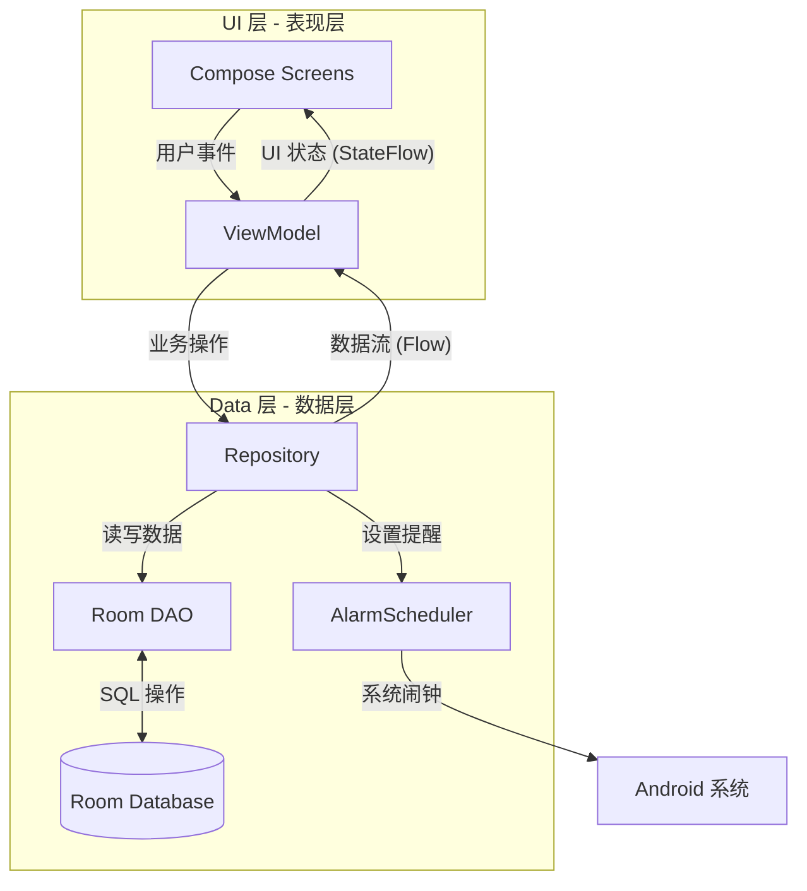

# Memory Helper

一个基于**艾宾浩斯遗忘曲线**的间隔重复记忆 (SRS) Android 应用，帮助用户通过科学的复习计划高效记忆内容。

## 功能特性

- **智能复习提醒**: 基于艾宾浩斯遗忘曲线自动计算最佳复习时间点
- **精准通知**: 使用 `AlarmManager` 实现精确的复习提醒，即使应用被关闭也能准时通知
- **记忆本管理**: 支持创建多个记忆本对内容进行分类管理
- **复习进度追踪**: 记录每次复习结果，支持"记住了"和"忘记了"两种反馈
- **数据统计**: 可视化展示复习数据和学习进度
- **Material Design 3**: 采用现代化 UI 设计，支持动态主题

## 核心算法

### 复习间隔
默认使用标准艾宾浩斯曲线间隔：
- 5 分钟 → 30 分钟 → 12 小时 → 1 天 → 2 天 → 4 天 → 7 天 → 15 天

### 复习逻辑
- **记住了**: 进入下一阶段，计算新的复习时间
- **忘记了**: 重置到第一阶段，从头开始复习周期
- **完成**: 完成所有阶段后标记为已完成

## 技术栈

| 类别 | 技术 |
|------|------|
| 语言 | Kotlin |
| UI 框架 | Jetpack Compose + Material 3 |
| 架构模式 | MVVM + Clean Architecture |
| 依赖注入 | Hilt |
| 数据库 | Room |
| 异步处理 | Kotlin Coroutines & Flow |
| 导航 | Navigation Compose |
| 图表 | Vico |
| 图片加载 | Coil |
| 桌面小组件 | Jetpack Glance |
| JSON 序列化 | Kotlin Serialization |

## 架构设计

本项目遵循 **MVVM (Model-View-ViewModel)** 架构模式，并结合 **Clean Architecture** 的原则进行分层设计，确保了代码的解耦和可维护性。

### 核心组件

1.  **UI Layer (表现层)**
    - **Jetpack Compose**: 声明式 UI 框架，负责界面渲染。
    - **ViewModel**: 负责管理 UI 状态，处理业务逻辑，与 Repository 交互。
2.  **Data Layer (数据层)**
    - **Repository**: 单一数据源，统一管理数据获取和业务处理。
    - **Room Database**: SQLite 数据库封装，提供本地数据持久化。
    - **AlarmScheduler**: 负责与 Android 系统 `AlarmManager` 交互，管理复习提醒。

### 架构与数据流向



## 项目结构

```text
app/src/main/java/com/example/memoryhelper/
├── alarm/                          # 闹钟和通知相关
│   ├── AlarmScheduler.kt          # 闹钟调度器
│   ├── AlarmReceiver.kt           # 闹钟广播接收器
│   └── BootReceiver.kt            # 开机重新调度闹钟
├── data/
│   ├── local/
│   │   ├── entity/                # Room 实体类
│   │   │   ├── MemoryItem.kt      # 记忆条目
│   │   │   ├── ReviewCurve.kt     # 复习曲线
│   │   │   ├── ReviewLog.kt       # 复习日志
│   │   │   └── Notebook.kt        # 记忆本
│   │   ├── dao/                   # 数据访问对象
│   │   ├── AppDatabase.kt         # 数据库定义
│   │   └── Converters.kt          # 类型转换器
│   └── repository/
│       └── MemoryRepository.kt    # 数据仓库
├── di/
│   └── DatabaseModule.kt          # Hilt 依赖注入模块
├── ui/
│   ├── screens/
│   │   ├── home/                  # 首页
│   │   ├── flashcard/             # 闪卡复习
│   │   └── stats/                 # 数据统计
│   └── theme/                     # 主题配置
├── MainActivity.kt                # 主 Activity
└── MemoryHelperApplication.kt     # Application 类
```

## 数据库设计

### MemoryItem (记忆条目)
| 字段 | 类型 | 说明 |
|------|------|------|
| id | Long | 主键 |
| notebook_id | Long | 所属记忆本 |
| curve_id | Long | 使用的复习曲线 |
| title | String | 标题 |
| content | String | 内容 (支持 Markdown) |
| status | Int | 状态 (0=新建, 1=复习中, 2=已完成, 3=暂停) |
| stage_index | Int | 当前复习阶段索引 |
| next_review_time | Long | 下次复习时间戳 |
| last_review_time | Long | 上次复习时间戳 |

### ReviewCurve (复习曲线)
| 字段 | 类型 | 说明 |
|------|------|------|
| id | Long | 主键 |
| name | String | 曲线名称 |
| intervals_json | String | 间隔列表 (JSON 格式，单位：分钟) |
| is_default | Boolean | 是否为默认曲线 |

### ReviewLog (复习日志)
| 字段 | 类型 | 说明 |
|------|------|------|
| id | Long | 主键 |
| item_id | Long | 关联的记忆条目 |
| actual_review_time | Long | 实际复习时间 |
| planned_review_time | Long | 计划复习时间 |
| review_action | Int | 复习动作 (1=记住, 2=忘记) |

## 环境要求

- Android Studio Ladybug 或更新版本
- JDK 17
- Android SDK 35 (编译)
- 最低支持 Android 8.0 (API 26)

## 构建与运行

```bash
# 克隆项目
git clone https://github.com/your-username/memory_helper.git

# 进入项目目录
cd memory_helper

# 构建 Debug 版本
./gradlew assembleDebug

# 安装到设备
./gradlew installDebug
```

## 权限说明

| 权限 | 用途 |
|------|------|
| `SCHEDULE_EXACT_ALARM` | 精准闹钟调度 (Android 12+) |
| `USE_EXACT_ALARM` | 使用精确闹钟 |
| `RECEIVE_BOOT_COMPLETED` | 开机后重新调度闹钟 |
| `POST_NOTIFICATIONS` | 发送通知 (Android 13+) |

## 开发路线

- [x] Phase 1: Room 数据库 + 基础 UI
- [x] Phase 2: 核心复习算法实现
- [x] Phase 3: AlarmManager 通知系统
- [x] Phase 4: 首页列表和复习交互
- [ ] Phase 5: Vico 图表统计
- [ ] Phase 6: 桌面小组件
- [ ] Phase 7: 数据备份与导出

## 贡献

欢迎提交 Issue 和 Pull Request！

## 许可证

[MIT License](LICENSE)
